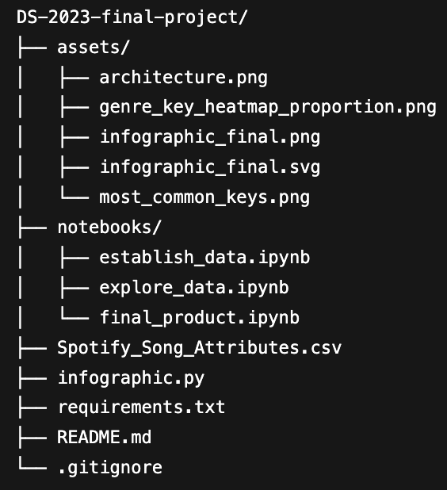
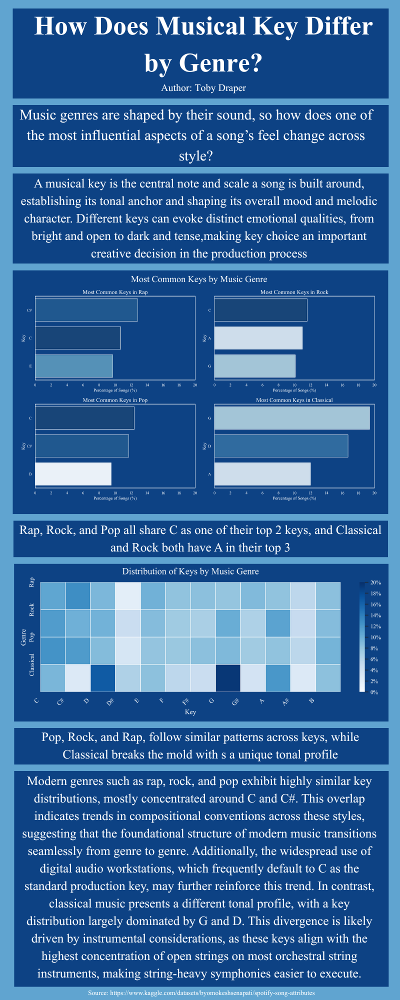

# Musical Key by Genre Infographic
## An Infographic Exploring How Musical Key Varies Across Genres

For this project, I used python code to transform raw data from a csv into a visually appealing infographic that displays the distribution of musical keys across various music genres. The infographic defines a musical key and explains the role they play in composition, as well as provides potential explanations for the trends observed. The dataset comes from Kaggle and contains just over 10,000 unique tracks drawn from the author's Spotify listening history in 2022.

## Architecture

Below is a diagram of the architecture of the system, followed by a breakdown of each component:

- **`DS-2023-final-project/`** — Root project directory for the DS 2023 Spotify key-distribution infographic project.  
  - **`assets/`** — Images used in the README and final deliverables.  
    - **`architecture.png`** — Architecture/tree diagram showing the project file structure.  
    - **`genre_key_heatmap_proportion.png`** — Heatmap visualization of key proportions by genre.  
    - **`infographic_final.png`** — Exported final infographic image (PNG).  
    - **`infographic_final.svg`** — Exported final infographic image (SVG).  
    - **`most_common_keys.png`** — 2x2 bar chart figure showing the top 3 musical keys in each genre.  

  - **`notebooks/`** — Jupyter notebooks documenting the workflow from data prep to final output.  
    - **`establish_data.ipynb`** — Loads the dataset and performs initial cleaning/formatting for analysis.  
    - **`explore_data.ipynb`** — Exploratory analysis and plotting to identify patterns used in the infographic.  
    - **`final_product.ipynb`** — Produces the finalized visuals/assets used in the final infographic.  

  - **`Spotify_Song_Attributes.csv`** — Raw Spotify dataset used for analysis and visualization.  
  - **`infographic.py`** — Main script to clean/transform the data and generate the plots saved in `assets/`.  
  - **`requirements.txt`** — Python dependencies needed to run the notebooks/script.  
  - **`README.md`** — Project overview, setup instructions, methodology, and results.  
  - **`.gitignore`** — Prevents unwanted files from being committed.  

## Final Product

Below is the finshed product:

